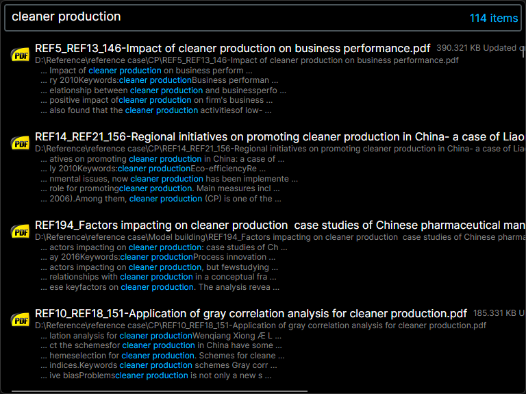

# TDSContent: Ultra-Fast File Content Search Tool

## Project Introduction
TDSContent is an open-source file content search tool developed in C# with an interface built using Avalonia. It can search file contents at millisecond-level speeds. Unlike traditional full-disk indexing tools, TDSContent requires users to specify particular folder directories and select file extensions. It then automatically creates indexes in the background and performs searches. It supports a variety of file formats, including Docx, Pptx, Json, Md, and more.

Fast content search within files in select folder (sub-folders).

Developers can also add their own file to string Converter to support custom indexing for additional formats.

## Core Features
- **Ultra-Fast Search**: Efficient indexing mechanism enables millisecond-level file content search.
- **Flexible Customization**: Users can specify folders and file extensions to meet personalized needs.
- **Near Real-Time Updates**: Utilizes USN (Update Sequence Number) technology to achieve near real-time updates for file content, filenames, and pathnames. TDSContent does not use a background thread to watch for file changes. Instead, it triggers incremental updates through the USN log during the next search. This approach ensures minimal performance overhead for monitoring file changes.
- **Powerful Indexing Engine**: Employs Lucene.Net as the file indexing engine to ensure accurate and efficient searching.

## Usage
1. **Specify Directories and Extensions**: Before using, users need to specify the folders to be searched and select the corresponding file extensions.
2. **Automatic Index Creation**: TDSContent automatically creates indexes for the files in the specified directories in the background.
3. **Search Operation**: Users can quickly search file contents by entering keywords in the interface.
4. **Index Update**: When file content, filenames, or pathnames change, TDSContent automatically updates the indexes.

## Technology Stack
- **Programming Language**: C#
- **UI Framework**: Avalonia
- **Indexing Engine**: Lucene.Net
- **Update Mechanism**: Based on USN

## License
TDSContent is licensed under the MIT License. However, it includes components that are licensed under the Apache License, Version 2.0. Please review the licenses of all components used in the project to ensure compliance.

This project includes components licensed under the Apache License, Version 2.0.
- Lucene.Net.Analysis.SmartCn: https://lucenenet.apache.org
- PDFiumCore: https://github.com/Dtronix/PDFiumCore

## Contribution Guide
We welcome any developers to participate in the development and improvement of TDSContent. You can contribute to the project by submitting Issues, Pull Requests, or joining discussions.

## Contact
For any questions, suggestions, or feedback, please feel free to open an issue on this repository or contact us directly.
We hope TDSContent can help you manage and search file contents more efficiently and enjoyable!
